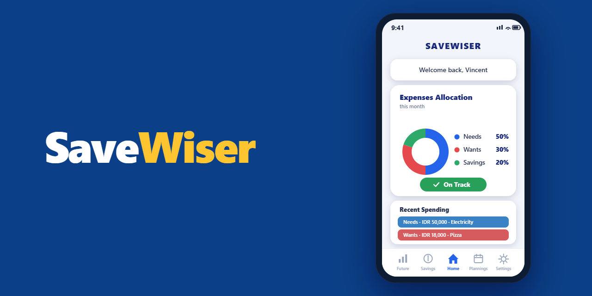

<div align="center">



# SaveWiser

**A personal savings & budgeting app that helps you spend on purpose, save automatically, and actually reach your goals.**


</div>

## What is SaveWiser?

SaveWiser is a mobile app for students and young people who want to take control of
their money without a finance degree. You set a savings goal, log what you spend, and
the app splits your money using the well-known **50/30/20 rule** - 50% for needs, 30%
for wants, 20% for savings - then tells you at a glance whether you're on track.

To make saving a habit rather than an afterthought, SaveWiser can **auto-lock a slice
of your income** (inspired by Singapore's CPF system) and optionally require a
**guardian's approval** before that locked money can be touched - a gentle guardrail
that's especially useful for students managing an allowance.

> All of your financial data stays **on your device**. Nothing is uploaded to a server.

## Features

- 📊 **50/30/20 budgeting** - every expense is sorted into Needs, Wants, or Savings, with a live "On Track / Off Track" indicator on the home screen.
- 🎯 **Savings goals** - set a target amount, a deadline, and a purpose ("Tuition fees", "New laptop"), and watch your progress.
- 🔒 **Auto-locked savings (CPF-style)** - automatically set aside a chosen percentage of income so it's saved before you can spend it.
- 🛡️ **Guardian Control** - let a parent or guardian approve withdrawals from locked savings with a passcode.
- 🧾 **Daily spending tracker** - quickly log transactions and see your recent spending at a glance.
- 🚨 **Overspending alerts** - get warned when you go over budget, with adjusted limits for the rest of the week.
- 📅 **Daily plannings** - a calendar view to plan spending and stay intentional day to day.
- 📈 **Future statistics & projections** - see where your savings are heading, with optional AI-generated advice on how to hit your goal faster.
- 🔔 **Daily reminders** - a local notification at a time you choose, to keep the habit alive.
- ❓ **Built-in FAQ & help** - plain-language answers to how budgeting, locking, and goals work.

## How it works

| Concept | What it means |
| --- | --- |
| **50/30/20 rule** | Your money is split into **Needs** (essentials like food & rent), **Wants** (extras like eating out), and **Savings**. |
| **Auto-lock** | A percentage of your income is locked away automatically, so saving happens first. |
| **Guardian Control** | Spending from locked savings needs a guardian's passcode - a pause-and-reflect step before dipping in. |
| **Goal** | The amount you want to save by a chosen date. SaveWiser tracks your pace against it. |

> 💡 Amounts in the app are shown in **Indonesian Rupiah (IDR)**.

## Tech stack

- **[Flutter](https://flutter.dev/)** & Dart - cross-platform UI (Android is the primary target).
- **[Hive](https://pub.dev/packages/hive)** - fast, local, on-device storage for transactions.
- **[shared_preferences](https://pub.dev/packages/shared_preferences)** - profile and settings.
- **[fl_chart](https://pub.dev/packages/fl_chart)** & **[pie_chart](https://pub.dev/packages/pie_chart)** - charts and the allocation donut.
- **[flutter_local_notifications](https://pub.dev/packages/flutter_local_notifications)** - daily reminders.
- **[OpenRouter](https://openrouter.ai/)** (optional) - powers the AI savings-advice feature.

## Getting started

### Prerequisites

- The [Flutter SDK](https://docs.flutter.dev/get-started/install) (with the Dart SDK it bundles).
- For Android builds: [Android Studio](https://developer.android.com/studio) with the Android SDK, platform-tools, and an emulator or a physical device.

Verify your setup with:

```bash
flutter doctor
```

### Run it locally

```bash
# 1. Clone the repository
git clone https://github.com/WilsonAnthonyT/SaveWiserApp.git

# 2. Move into the Flutter project (where pubspec.yaml lives)
cd SaveWiserApp/savewiser

# 3. Fetch dependencies
flutter pub get

# 4. Launch on a connected device or emulator
flutter run
```

### Build a release

```bash
# Android APK
flutter build apk --release

# Android App Bundle (for the Play Store)
flutter build appbundle --release
```

The build output lands in `savewiser/build/app/outputs/`.

## Optional: enabling AI savings advice

The "Future Statistics" screen can generate short, personalized savings tips using
[OpenRouter](https://openrouter.ai/). This is **optional** - the rest of the app works
without it.

The API key is **never stored in the source code**. Provide your own key at build/run
time with `--dart-define`:

```bash
flutter run --dart-define=OPENROUTER_API_KEY=your_key_here
```

Get a free key at [openrouter.ai/keys](https://openrouter.ai/keys). Without a key, the
AI advice request simply won't return suggestions; everything else is unaffected.

## Project structure

```
savewiser/
├── lib/
│   ├── main.dart                 # App entry point & initialization
│   ├── main_nav.dart             # Bottom navigation shell
│   ├── setup_page.dart           # First-run onboarding (profile, goal, preferences)
│   ├── models/                   # Data models (e.g. Transaction, with Hive adapters)
│   ├── pages/                    # App screens (home, savings, plannings, settings, ...)
│   ├── services/                 # Notifications, image picking, API calls
│   └── utils/                    # Helpers (balance recalculation, input formatters)
├── assets/                       # App logo and images
└── pubspec.yaml                  # Dependencies & project config
```

## Contributing

Contributions are welcome! Please read [CONTRIBUTING.md](CONTRIBUTING.md) to get started,
and note our [Code of Conduct](CODE_OF_CONDUCT.md).

## Security

Found a vulnerability or an exposed secret? Please see [SECURITY.md](SECURITY.md) for
how to report it responsibly.

## License

Distributed under the MIT License. See [LICENSE](LICENSE) for details.

## Contact & support

Questions or feedback? Reach the team at **savewiserhelps@gmail.com**.

---

<div align="center">

*SaveWiser is a personal budgeting tool, not a licensed financial advisor. It's here to
help you build good habits - the decisions are always yours.*

</div>
